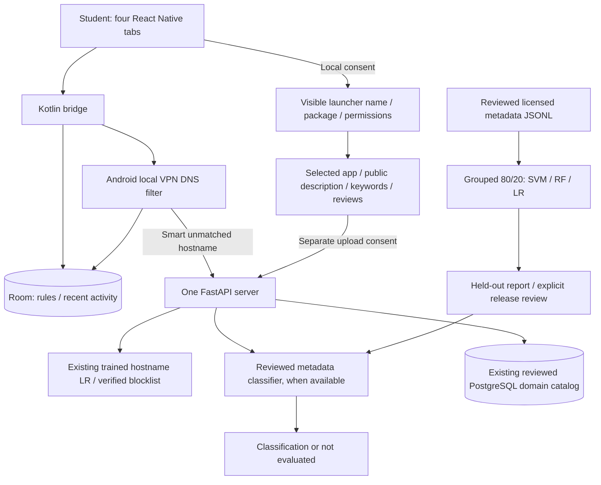
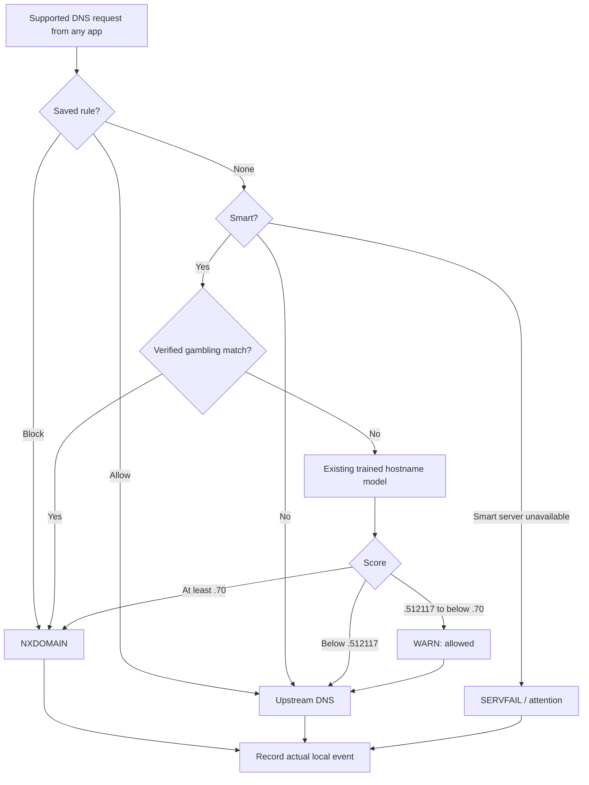

# BetGuard capstone alignment

Source reviewed: **ma'am alme.docx**, “Automated Detection and Blocking of Online Gambling Applications for Students Using Machine Learning,” May 2026, BISU Clarin. Review covered all 400 extracted paragraphs, problem statements, methodology, definitions, references, formulas, conceptual diagram, sample dataset, model-development diagram, SDLC and Gantt chart. Appendices and author biodata are not product requirements and are not copied into the app. The source document is unchanged.

The user clarified that BetGuard should **restrict gambling network access on student-owned phones**. App suspension, uninstalling other apps, device-owner enrollment and preventing app launches are outside this implementation scope. The document is project reference material, not authorization to recruit students, change credentials or publish study conclusions.

## Existing trained model

Your trained model already exists at `ml/models/baseline_domain_classifier.joblib` and is integrated into FastAPI and Android Smart protection. It is a fitted character 3–5-gram TF-IDF / Logistic Regression pipeline. `deployment_candidate.json` selects it over a separate lexical hybrid Logistic Regression candidate. Existing artifacts, thresholds, dataset and runtime blocklist are retained; no retraining was performed.

Its input is a **hostname**, whereas the document describes app names, descriptions, keywords, requested permissions and public reviews. Passing a package ID or description to the domain model would not fulfill that requirement. The new app review path therefore uses a separate schema and optional reviewed metadata model. Without that genuine artifact it reports **not evaluated**, while your existing trained model continues to work in Smart mode.

Figure 3 contains casino/game/provider/RTP/currency/licensing fields. It does not demonstrate a two-class app dataset with descriptions, permissions and reviews. Positive gambling records alone cannot establish specificity or false blocking of legitimate apps. The repository CSV is domain-feature data. Neither is relabeled as metadata or used to fabricate negative examples.

## Requirement traceability

| Document requirement | Behavior / evidence | Remaining condition |
| --- | --- | --- |
| Rationale; Statement 1: protect BISU students from gambling websites/apps | Student purpose and network scope in quick guide, Protection, app review and Settings. Existing automatic DNS decisions apply to supported browser/app requests. | DNS is limited coverage; measure outcomes in an approved pilot. |
| Instrument; IPO: name, description, keywords, permissions, reviews | Consent-based Review an app, local visible-app selection, public text inputs, `/v1/apps/check`, bounded schema and text features. | Reviewed licensed metadata dataset and fitted metadata artifact are not present. |
| Statement 1.1–1.3; Model Training: SVM, RF, LR | Runnable metadata experiment fits all three on the same grouped partitions; development cross-validation selects before test exposure. | Run after collecting real data. Existing LR artifacts are not evidence of an SVM/RF app experiment. |
| Dataset; Data Splitting: 80/20 | Metadata workflow reserves about 20% of independent groups and fits candidates on the remaining 80%; three-fold grouped CV stays inside development. | Group sizes can change row proportions; report actual counts. Existing domain experiment stays 507/169/170, about 60/20/20. |
| Statement 2: accuracy, precision, sensitivity, specificity, TSS; F1 | Metadata comparison includes every metric and `[[TN,FP],[FN,TP]]`. Existing hostname research metrics now expose sensitivity/TSS. Saved domain evidence is summarized without another test run. | Metrics describe a dataset/task/threshold, not student protection rates. |
| Design/Evaluation: efficiency and overfitting | Training/CV time, model-only median/p95 latency, development fit, out-of-fold development and held-out metrics. | Real device/network timing and future noisy/temporal/language cohorts remain research measurements. |
| Statement 3: architecture, conceptual diagram, requirements, flowchart | Actual architecture/IPO/runtime flow below; offline/online limits and requirements documented. | Configure deployed HTTPS address for standalone Smart protection. |
| Statement 4: database and interface | Room rules/history and reviewed server catalog retained; four tabs plus hidden app-review/link-check screens; versioned research files. | No migration/student table needed; research is separate from production catalog. |
| Statement 5: human expert comparison | `experts` validates one blinded expert label per held-out case; reports paired metrics, agreement, kappa and exact McNemar comparison. | Researchers must supply independent expert assessments. Software fixtures are not study findings. |
| Statement 6: relationship to exposure reduction | Anonymized paired pilot schema, descriptive rates/change report, UAT/survey procedure. | No BISU study performed by this change; no reduction claim. |
| Participants: enrolled consenting BISU undergraduates; stratification | Research protocol records recruitment conditions; app permissions and research consent are distinct. | Faculty-approved recruitment, consent and questionnaire validation are external work. |
| Integration/Deployment: automatic detection and restriction | Existing local choice → verified list → trained hostname ML → actual DNS block/allow/WARN → Activity. Known app hostnames can be saved as rules. | Metadata alone does not identify every app domain; no invented package/domain bindings or app-wide blocking. |
| Privacy/transparency | Inventory only after consent, selection before upload, separate upload consent, cancel/clear/discard on leaving, no API metadata persistence, input-safe errors. | Production host logging/security and institutional research handling need deployment review; no legal compliance certification. |
| Maintenance/updates | Existing versioned APK workflow; explicit comparison/export with trusted artifact hashes; no background training. | Data/model updates are reviewed releases, not automatic learning from students. |

## Functional and nonfunctional requirements

1. Status comes from the Android service. Checking content does not enable protection or save a rule.
2. Saved exact/subdomain Allow/Block choices take priority. Local mode requires no FastAPI; unmatched requests resolve upstream.
3. Smart mode sends unmatched hostnames to FastAPI. Verified gambling matches and ML scores at least .70 block; .512117 to below .70 warn and stay allowed. Existing model/thresholds are preserved.
4. App selection reads visible launcher labels, package IDs and **requested permission names** only after consent. It reads no permission-protected content and does not claim those permissions were granted. Store descriptions/reviews are supplied manually.
5. Online app review requires separate consent; editing revokes it and invalidates results. Cancel/navigation/unmount prevent stale results. No inventory batch upload, background scanning or usage monitoring.
6. A name/permission declaration alone is insufficient. Missing/incompatible metadata models return unknown and never pass app text to a hostname classifier.
7. Save only a known app hostname as a network rule, then enable protection. Shared domains can affect other apps; package IDs are not hostnames.
8. Network filtering does not prevent launch. Supported new IPv4 UDP DNS is covered; encrypted/private DNS, alternate resolvers, TCP DNS, cached addresses, direct IPs and existing connections may bypass it.

Operational requirements: one bounded inference worker per configured model; deadlines/cancellation and no unbounded queues; one app per request with description <=6,000 characters, <=40 keywords, <=150 permission names and <=10 reviews of <=1,000 characters; HTTPS saved-APK endpoint; no database secrets in the APK; model integrity/version checks; System/Light/Dark appearance; labeled controls and Android Back; local history deletion without rule deletion; no required student identity/account.

## Architecture and conceptual flow

IPO: **input** public app metadata / hostname; **process** normalize/validate → appropriate trained classifier or unknown → applicable network policy; **output** classification, supported DNS outcome and Activity. Metadata review is advisory pending a real model and evidenced app/domain mapping. Automatic hostname-based network restriction already works.

## Storage design

| Store | Data | Retention / ownership |
| --- | --- | --- |
| Room rules | Domain, action, exact/subdomain scope, update time | Student device, retained across matching signed updates |
| Room activity | Event ID/kind, domain, detail, creation time | Latest 200, user can clear |
| Native preferences | Appearance / existing detection settings | Device-local |
| Reviewed PostgreSQL catalog | Domain/classification/provenance/review dates/status | Existing backend; predictions do not become reviewed labels |
| App-review screen memory | Visible apps, selected metadata, current result | Cleared on leaving/clear; no Room/API DB persistence |
| Research JSONL/runs | Evidence/license/review, groups, splits, results, artifacts | Researcher-controlled ignored backend/data, runs, models; no automatic student collection |

## Use and update

Use the existing three-terminal workflow in [APP_GUIDE](../frontend/docs/APP_GUIDE.md). No separate ML server or training command is needed to use the existing trained model.

Phone: **Protection → Review an app → local consent → choose app → add public description/reviews → upload consent → Review app information**. Missing metadata model yields **NOT EVALUATED**, not a non-gambling label. **Add an app website rule** accepts a known hostname; enable protection on Home. Smart continues using your trained domain model.

`GET /health/apps` reports app model readiness separately from `/health/detection`. `POST /v1/apps/check` does not save inputs. Existing domain endpoints, overrides and DNS policy stay compatible.

From frontend, `npm.cmd run apk:save` saves improvements; `npm.cmd run apk:install` also installs with the existing development signing key. Standalone online features need deployed HTTPS `remoteBaseUrl`. Current blank release configuration supports local rules and local app selection; debug uses the PC via USB reverse forwarding.

## Evidence and remaining research work

See [APP_METADATA_RESEARCH](../backend/docs/research/APP_METADATA_RESEARCH.md) for data/commands/participants/expert comparison. [Existing domain evidence](../backend/docs/research/EXISTING_DOMAIN_EVIDENCE.json) distinguishes original training threshold, selected candidate threshold and live hard-block threshold. No weights or holdout exposure changed.

The saved external v2 report has 98 labeled domains. At the combined hard-block policy .70: TN=61, FP=0, FN=18, TP=19; accuracy 81.63%, precision 100%, sensitivity 51.35%, specificity 100%, TSS .5135. Review-or-block has higher recall because **WARN remains allowed**. These small-holdout domain figures are not app-metadata accuracy, all-app coverage or evidence of student exposure reduction.

The clarified personal-phone network scope is implemented, subject to stated DNS limitations. Empirical manuscript requirements remain incomplete until reviewed app metadata, fitted SVM/RF comparisons, independent expert decisions and consented BISU UAT/pilot measurements exist. The thesis should distinguish casino-only examples from a two-class metadata dataset and report actual grouping, splits, thresholds and coverage limits.

## Platform references and verification

Launcher visibility follows [Android package visibility](https://developer.android.com/training/package-visibility/declaring). Network routing follows [Android's VPN guide](https://developer.android.com/develop/connectivity/vpn); routing a package into a VPN alone does not guarantee app-wide restriction. Synthetic software-test artifacts are rejected for deployment. Final test/build/device results are recorded below after verification. No participant study, new real-data training, Supabase migration or model replacement is claimed.

Verified October 7, 2026:

- Frontend: typecheck and lint passed; **140 tests in 12 suites passed**. New cases cover local-list consent, selected-only upload, result invalidation, consent revocation, cancellation/stale responses, navigation clearing and response-contract validation.
- Backend: **123 tests passed, one PostgreSQL integration test skipped**; no claim of a new live database integration test. Metadata software fixtures compare all three estimators, keep grouped holdout isolation and cannot export/deploy. Existing domain/catalog tests pass after the inference helper change.
- Android: `:app:testDevelopmentDebugUnitTest` passed, including the existing native policy/DNS regression harness. Release build completed successfully; manifest/version validated as `com.betguard.dev`, 1.3.0, build 10, minimum SDK 24 / target SDK 36.
- Live existing backend: `/health/detection` ready with baseline; `/health/apps` correctly reports metadata model absent; an explicit software-only metadata request returns unknown / app_model_unavailable / dns_network_only. No app model was fabricated to satisfy the document.
- Physical phone: updated BetGuard Dev installed with data retained; local-list consent/cancel, visible-app selection, requested-permission metadata, offline online-feature limitation, Android Back and session clearing verified. Initial automation sampled the asynchronous inventory before it loaded; a bounded wait resolved the test, and the complete smoke test passed. No rules were saved/removed and protection was not enabled/stopped by this test; it finished on Home with protection off.
- Seven original model/config/blocklist files compared against initial SHA-256 values: **zero changes**. No `.env` edits, dependency changes or Supabase migrations.

Saved artifact: [BetGuard-v1.3.0-b10.apk](../frontend/build/apk/BetGuard-v1.3.0-b10.apk), also copied to the phone's Download folder. SHA-256: `069f1b11924bcde19fd558357a49592064c7b2d11c6456224c163306662b9c55`. Future updates use the existing APK script/version file. This saved build has no deployed online URL; local selection/rules work and online review/Smart require configuring the service, or the existing USB debug workflow.

Local verification captures/logs remain under ignored `verification/`. The source document SHA-256 is `e8a74c7480e36cc78d280244f4fc0fa46c8c4e8c72d81f3ef866847f8c9db1e8`; its private appendix/biodata was not added to product documentation.
