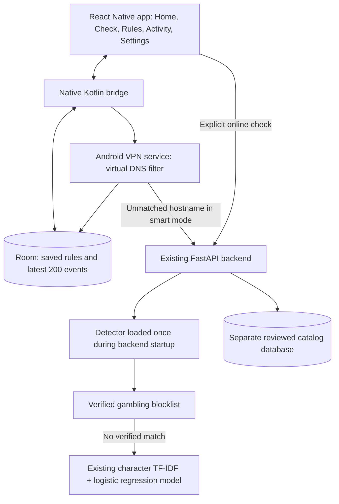
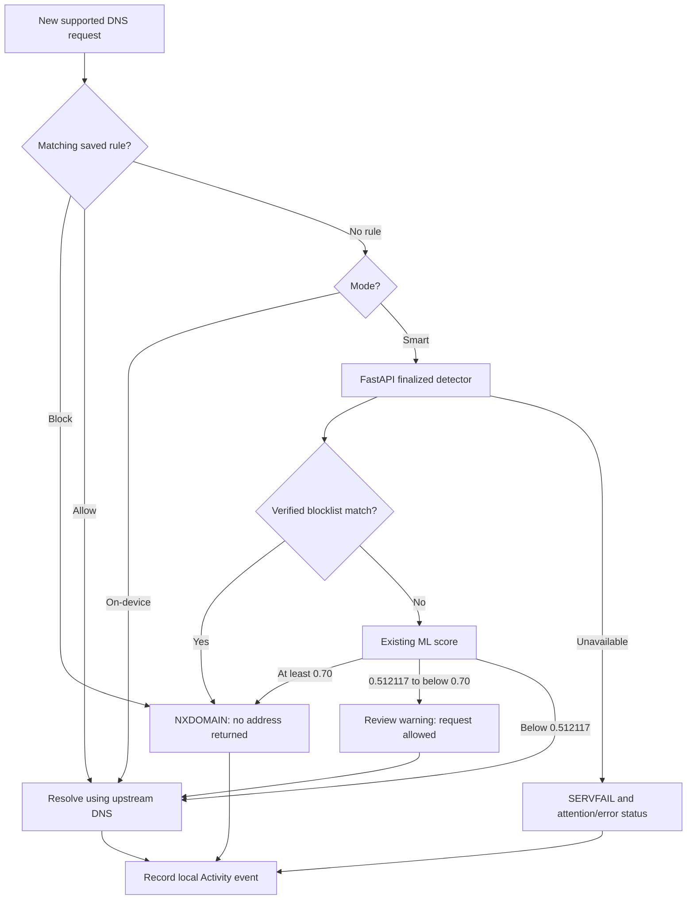

# BetGuard: using the app and updating it

For the separate phone-hosted gateway, client setup and exact development commands, see [Network Protection](NETWORK_PROTECTION.md).

BetGuard runs a DNS filter on your Android phone. You decide which websites to block or allow. Optional smart protection asks your FastAPI server to check unmatched hostnames against the verified gambling blocklist and trained model. Checking a link, saving a rule and enabling protection are three separate actions.

The premium interface is documented in [the redesign report](PREMIUM_REDESIGN_REPORT.md); the capstone app-review update is documented in [the alignment report](../../docs/CAPSTONE_ALIGNMENT.md). The current build/version comes from the shared app.version.json; future builds use the update commands below.

## Start here

1. Open **BetGuard Dev**. It is the updated installation; the older BetGuard installation was kept because it uses a different signing key.
2. On Home, choose **On-device rules** or **Smart protection**.
3. For on-device mode, open **Rules**, enter a website and select Block site. Return Home.
4. Tap **Enable protection**. Read the network permission explanation and tap Continue. Approve Android's VPN request if asked. Wait for **Protected / DNS FILTER ACTIVE**.
5. Browse normally. Open **Activity** to see supported requests that BetGuard handled. A link-check result alone is not proof that traffic was blocked.
6. To switch modes, hold **Hold to pause protection** for 2.5 seconds, select the other mode and enable it again. Releasing early cancels the hold. Screen-reader users can confirm pausing without holding. Re-enable after restarting the phone or terminating the app.

The Home and Settings **How BetGuard works** control opens the same short guide. It can be closed to keep the interface minimal.

## Offline and online mean different things

| Capability | On-device rules | Smart protection |
| --- | --- | --- |
| Stored rules and history | On the phone | On the phone |
| Saved Block/Allow choices | Applied locally | Applied locally, before online detection |
| No matching rule | Request allowed | Server checks blocklist, then ML |
| Needs BetGuard server | No | Yes, reachable through the configured address |
| Runs ML on the phone | No | No: ML runs on the server |
| Needs internet to browse websites | Yes | Yes |
| Server unavailable | Local rules keep working | Unmatched requests can return DNS errors; app shows attention/error |

“Offline” means the rule engine does not need BetGuard's server. It does not download websites or provide internet access. Allowed DNS queries still need an upstream resolver. A blocked request can be answered locally without the backend.

The saved APK currently has no deployed service address configured. It works with on-device rules and local app selection; Smart protection and online app review require a reachable configured service. This is separate from whether the phone has Wi-Fi or mobile data.

Smart mode automatically blocks the server's verified-list and high-risk ML `BLOCK` results for new supported DNS requests. You do not need to save those domains one by one. `WARN` results stay allowed unless you save a local Block rule. Follow the [Smart protection test guide](SMART_PROTECTION_TEST.md) for exact terminal commands, the running-server check script, and phone tests that distinguish ML blocking from manual rules or blocklist matches.

## What each tab does

| Tab | Use it for |
| --- | --- |
| Home | Select a mode, enable/stop protection and see actual native status. |
| Protection | Search and filter saved website rules. Add website opens a sheet for a URL/hostname and Block/Allow choice. Tap a rule to edit its scope, change its action, or confirm removal. |
| Activity | See actual DNS outcomes plus local rule/check/service events. Filters separate blocked, warnings, allowed and other events. Only 200 entries are retained. |
| Settings | Open the quick guide, manage protection/rules, choose System/Light/Dark appearance, open Android settings and clear history. |

The bottom bar has four destinations: **Home, Activity, Protection, Settings**. **Check a link** opens from Home or Protection. It keeps the existing check screen and API pipeline; it is no longer a fifth bottom-bar item. Technical decision details and DNS limitations are expandable.

Home's shield says **Protected** only when the native service reports `active`. Starting, stopping, degraded, interrupted and failed states have distinct labels. On-device mode can be active with no saved rules; in that case no website is blocked by a local rule. Dashboard metrics count actual retained DNS outcomes, not link checks, unique sites or lifetime threats. A review warning is allowed. The occasional red shield flash marks a new blocked event and returns to the current protection state. Motion follows Android's reduced-motion setting.

**Block** means a supported DNS request is refused while protection is on. **Review/WARN** is uncertain advice; access stays allowed. **Allow** is permission to continue, not a guarantee of website safety. Continue once opens the checked hostname without saving a rule. Always allow and Block site save persistent choices. A check can run while protection is off; it does not turn protection on.

## Actual architecture

**Review an app** opens from Protection. It asks before reading visible launchable app names/package IDs/requested permission names. Select an app and add its public description, keywords and optional public reviews; Android does not supply store descriptions/reviews. Agree separately before sending only that selected metadata to `/v1/apps/check`. Editing revokes consent and clears the prior result; cancel or leaving discards the session data. A missing metadata model reports **NOT EVALUATED**. Your existing trained hostname model stays in Smart protection; it is not used to classify app descriptions.

App reviews do not enable protection or create rules. If you know an app's gambling hostname, use **Add an app website rule**, save your choice and enable protection on Home. Filtering applies to supported DNS connections, not app launches or all app traffic. See [capstone alignment](../../docs/CAPSTONE_ALIGNMENT.md) for complete traceability and remaining research evidence.



- **React Native / TypeScript**: `frontend/App.tsx`, `src/screens`, `src/components`, `src/state`, `src/api`. Screen names do not define enforcement; they call the native bridge and existing HTTP client.
- **Android / Kotlin**: `BetGuardModule.kt`, `BetGuardVpnService.kt`, `RuleRepository.kt`, `DetectionClient.kt` and `filter/core`. Android VPN permission creates a local virtual DNS interface; it is not a remote VPN that hides location. Only one Android VPN can be active per profile.
- **Local persistence**: Room stores rules and recent activity; native preferences store appearance. App updates with the same identity/key retain this data. Server `.env` credentials are never bundled into the APK.
- **FastAPI**: `backend/app/main.py` owns startup/lifespan and the existing API. `/v1/domain/check` and batch detection delegate through `app/services/domain_service.py`. The runtime/model/blocklist load once per backend process, rather than on each request.
- **ML**: `ml/src/runtime_service.py` and `decision_engine.py` use the existing model artifact, verified list and thresholds. Nothing in this UI update retrains or changes them.
- **Reviewed catalog**: `/v1/check` uses the existing database path. A catalog outage is separate from detector availability; a working smart result remains visible. Catalog details are expandable.

## How a website request flows



The most specific matching local rule wins, including exact/subdomain scope. Local Allow can override automatic blocking; local Block can override an otherwise allowed detector result. The server does not read the phone's Room rules.

For example, an exact rule for `example.com` does not match `www.example.com`. Turn on Include subdomains when saving the parent domain to cover both. A rule applies to every page on its matching hostname, rather than just the URL path you pasted.

DNS filtering covers new IPv4 UDP DNS through BetGuard's virtual resolver. Encrypted/private DNS, external resolvers, TCP DNS, cached addresses, direct IP access and existing connections can bypass it. A browser warning page is not injected into arbitrary HTTPS traffic. The review flow lives in Check link; actual blocking outcomes appear in Activity.

To test a saved Block rule, enable protection, fully restart your browser and reload the website. Restoring an old tab can display previously loaded content without making a new request. For a controlled Chrome test over USB, use a different URL each time:

```powershell
$adbPath = Join-Path $env:LOCALAPPDATA 'Android\Sdk\platform-tools\adb.exe'
$testId = [DateTimeOffset]::UtcNow.ToUnixTimeMilliseconds()
& $adbPath shell am force-stop com.android.chrome
& $adbPath shell am start -a android.intent.action.VIEW -d "https://example.com/?betguard_test=$testId" -p com.android.chrome
```

Confirm both a browser DNS error and a **new** `example.com` Blocked event in Activity. A restored page does not prove a new connection succeeded, and a browser error alone can also mean a connection/resolver failure. This filter cannot erase previously downloaded content or interrupt every existing connection.

## Test online from your PC

This is the debug workflow; it requires the PC and USB connection.

Reuse an already running backend or Metro instance instead of starting another on the same port.

From `betguard/backend`:

```powershell
.venv\Scripts\python.exe -m uvicorn app.main:app --host 127.0.0.1 --port 8000 --reload --no-access-log
```

From `betguard/frontend`, in another terminal:

```powershell
npm.cmd start
```

Then use another frontend terminal:

```powershell
# These are the verified Windows locations on this computer.
$env:JAVA_HOME = 'C:\Program Files\Java\jdk-21'
$env:ANDROID_HOME = Join-Path $env:LOCALAPPDATA 'Android\Sdk'
$env:PATH = "$env:ANDROID_HOME\platform-tools;$env:JAVA_HOME\bin;$env:PATH"
npm.cmd run android
adb reverse tcp:8000 tcp:8000
adb reverse tcp:8081 tcp:8081
```

Open BetGuard Dev, select Smart protection and enable it. Debug `developmentTarget: device` uses localhost on the phone, forwarded by adb to your PC. Restore the mappings after reconnecting USB. Metro delivers debug JavaScript; FastAPI supplies detection. They are separate processes.

For backend inspection, use `http://127.0.0.1:8000/docs` and `/health/detection`. The API root is not the mobile interface and can return Not Found.

## Save every improvement as an APK

From `betguard/frontend`:

```powershell
# Verify, build and save a standalone APK.
npm.cmd run apk:save

# Verify, build, save, update the connected phone and copy to Download.
npm.cmd run apk:install
```

The script runs typecheck, lint and frontend tests; increments the Android build number in `app.version.json`; builds developmentRelease with bundled JavaScript; saves a versioned APK, `build/apk/BetGuard-latest.apk` and a SHA-256 checksum. With install selected, it uses `adb install -r`, copies the versioned APK to Download and launches BetGuard Dev. A failed check/build/install stops the process; it never uninstalls an app to bypass a signing failure. A build number can be consumed by a failed build; gaps are harmless.

Both commands build for the connected phone's arm64 architecture by default. To choose supported architectures, pass `-Architectures arm64-v8a,armeabi-v7a,x86,x86_64` to the PowerShell script. Set JAVA_HOME to a full compatible JDK and ANDROID_HOME to the Android SDK; JDK 21, SDK 36/Build-Tools 36.1.0/NDK 27.3.13750724 are the verified toolchain. npm scripts invoke PowerShell with a process-only execution-policy override; they do not change the machine's policy.

To change the displayed version while installing an improvement:

```powershell
npm.cmd run apk:install -- -VersionName 1.2.0
```

The UI and Android manifest share `app.version.json`. Settings shows the version and build number. The updated APK replaces **BetGuard Dev**, preserving its own rules/preferences/history. It does not replace the older differently signed **BetGuard**. Keep the signing keystore safe. These APKs use the existing development signing key; a store release needs release signing.

**Changes are not pushed automatically.** During USB debug development, JS-only changes can reload through Metro. Kotlin/native changes require a rebuilt debug APK. A saved APK contains a snapshot of the app, so every improvement needs rebuilding and installing a new APK. No OTA or Play Store update service is configured.

## Use smart protection without a PC

1. Deploy the existing FastAPI backend at a reachable HTTPS address, with its model/runtime resources and private server environment.
2. Put only its public HTTPS address in `frontend/api.config.json` → `remoteBaseUrl`.
3. Run `npm.cmd run apk:install` to build and install the updated saved app.
4. Select Smart protection. The phone now connects to that server through Wi-Fi/mobile data; Metro, USB forwarding and your PC are no longer needed.

No deployed URL was supplied, so this task does not invent one or publish a backend. The current saved APK offers on-device rules; a debug build with USB can test the local online detector.

## October 6 verification

The guided UI was built and installed on the connected RMX3710 (Android 13, arm64). The saved APK launched with Metro forwarding removed. The guide opened on the phone; Smart protection was correctly disabled with no remote service configured; local link checking displayed LOCAL RULE CHECK without an online error. Actual on-device DNS returned NXDOMAIN for the saved exact www.facebook.com block rule and normal answers for wikipedia.org. Stop returned OFF.

The complete build/update script ran typecheck, lint and all 119 frontend tests successfully, built version 1.1.0/build 4, installed it over BetGuard Dev and copied BetGuard-v1.1.0-b4.apk to Download. Interactive checks covered the guided build before the final status-copy/version update; Android installation metadata confirmed the final build number. All 19 checked ML/data hashes were unchanged. Backend/ML logic and existing signing keys were not changed in this update.
